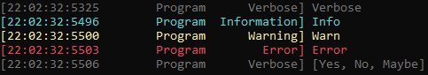

# RadLibrary

All-In-One library

## Features

- Logger
- Input predictions
- Configuration manager

## Logging sample

```csharp
var logger = LoggerUtils.GetLogger("Program");
logger.Verbose("Verbose");
logger.Info("Info");
logger.Warn("Warn");
logger.Error("Error");
logger.Verbose(new List<string> { "Yes", "No", "Maybe" });
```



## Logging sample with custom settings

```csharp
var logger = LoggerUtils.GetLogger("Program");
var settings = new LoggerSettings
{
    LogLevel = LogType.Information,
    InformationColor = ConsoleColor.DarkCyan
};
logger.Settings = settings;
logger.Info("New color test");
```

## User input with predictions

```csharp
// default engine will only predict files and "yes" or "no"
var input = logger.GetInput(engine: new DefaultPredictionEngine());
```

## Configuration sample

```csharp
// "cfg" is a filename in this case
var cfg = new AppConfiguration<FileManager>("cfg");
cfg.ConfigurationUpdated += () => logger.Success("Updated! {0}", cfg["entry"]);
```
