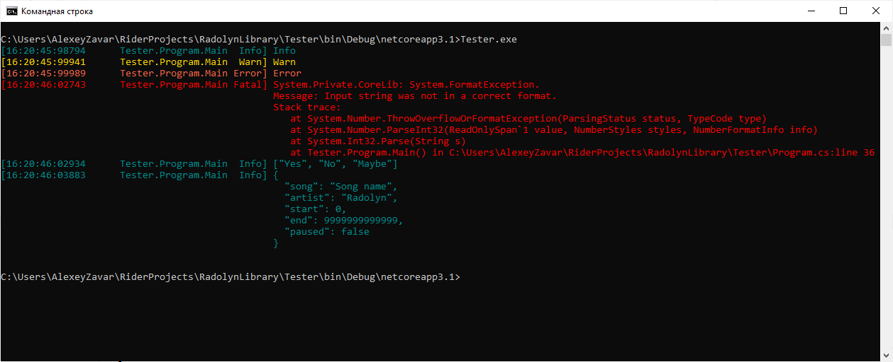
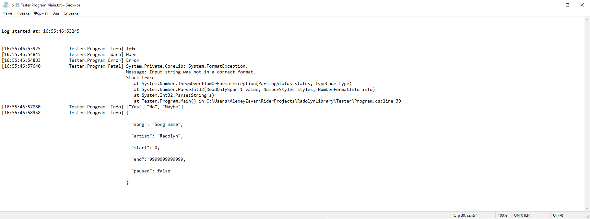
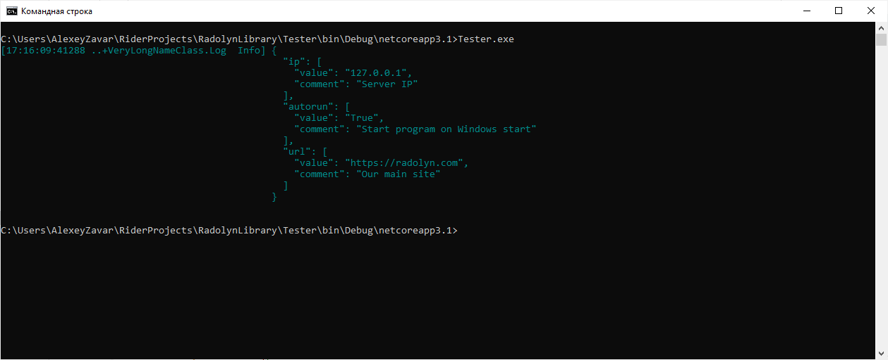
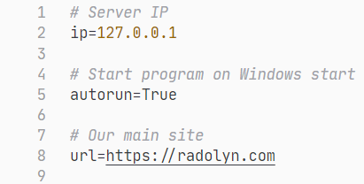

# RadLibrary

[](https://app.codacy.com/gh/Radolyn/RadLibrary?utm_source=github.com&utm_medium=referral&utm_content=Radolyn/RadLibrary&utm_campaign=Badge_Grade_Dashboard)
[](https://www.nuget.org/packages/RadLibrary/)

All-In-One library

## Features

- Customizable logger
  - Custom colors
  - Prints dictionaries and lists like in Python
  - Integrated with configuration manager
  - Thread-safe
- Configuration manager
  - Comments support
  - Casts support

## Getting started

### Logging sample

```csharp
var logger = LogManager.GetMethodLogger();

logger.Trace("Trace");
logger.Debug("Debug");
logger.Info("Info");
logger.Warn("Warn");
logger.Error("Error");

try
{
  int.Parse("sadasd");
}
catch (Exception e)
{
  logger.Fatal(e);
}

logger.Info(new List<string> { "Yes", "No", "Maybe" });
logger.Info("{\"song\":\"Song name\",\"artist\":\"Radolyn\",\"start\":0,\"end\":9999999999999,\"paused\":false}");

```



### Multilogger sample

```csharp
var consoleLogger = LogManager.GetMethodLogger();
var fileLogger = LogManager.GetMethodLogger<FileLogger>();

var logger = LogManager.GetClassLogger<MultiLogger>(consoleLogger, fileLogger);

logger.Trace("Trace");
logger.Debug("Debug");
logger.Info("Info");
logger.Warn("Warn");
logger.Error("Error");

try
{
  int.Parse("sadasd");
}
catch (Exception e)
{
  logger.Fatal(e);
}

logger.Info(new List<string> { "Yes", "No", "Maybe" });
logger.Info("{\"song\":\"Song name\",\"artist\":\"Radolyn\",\"start\":0,\"end\":9999999999999,\"paused\":false}");

```




### Configuration sample

```csharp
var logger = LogManager.GetMethodLogger();
var config = AppConfiguration.Initialize<FileManager>("tester");

config["ip"] = "127.0.0.1";
config.SetBool("autorun", true);
config["url"] = "https://radolyn.com";

config.SetComment("ip", "Server IP");
config.SetComment("autorun", "Start program on Windows start");
config.SetComment("url", "Our main site");

config.Save();

logger.Info(config);
```




