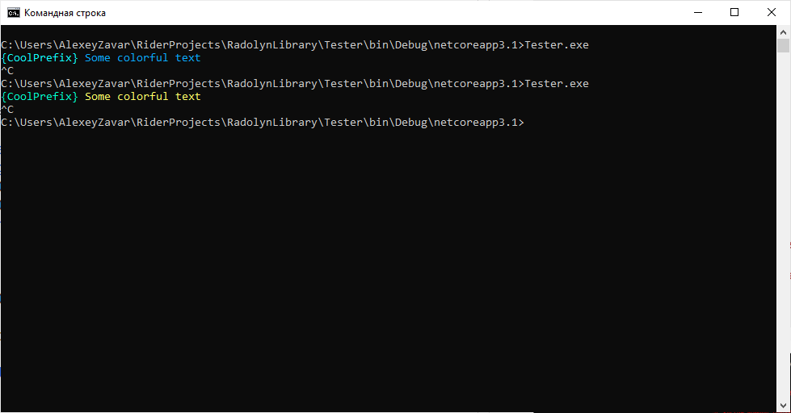
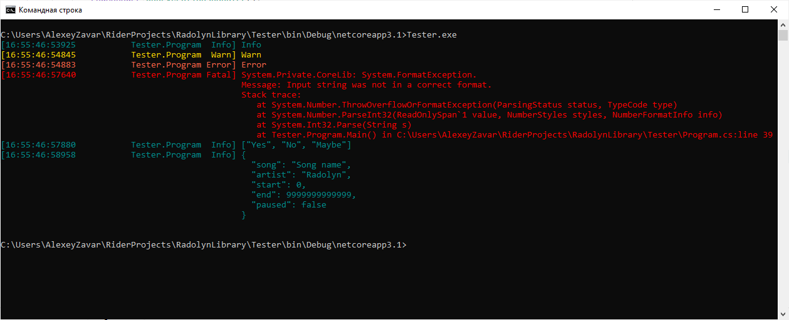
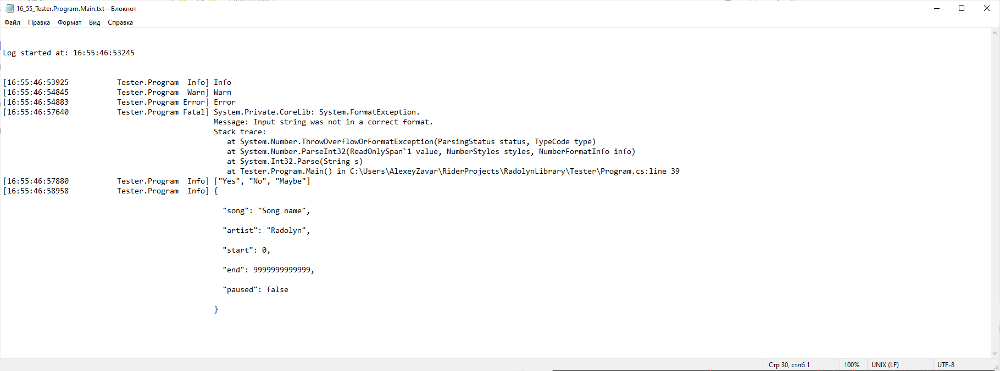
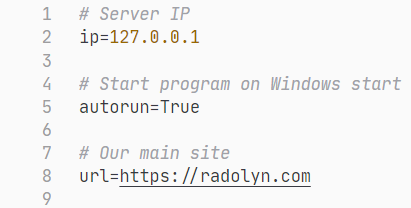

# RadLibrary

[](https://app.codacy.com/gh/Radolyn/RadLibrary/dashboard)
[](https://www.codefactor.io/repository/github/radolyn/radlibrary)
[](https://www.nuget.org/packages/RadLibrary/)

All-In-One library

## Features

- Customizable logger
  - Prints dictionaries and lists like in ```Python```
- Colorful console support
  - Custom colors (**HEX string->Color class convert support** through ```Colorizer```)
  - ESC colors access through ```Font, Background & Foreground``` classes
  - ```Console``` wrapper for ease of use (```RadConsole```)
  - Colorful **input**
- Configuration manager
  - Comments support
  - Scheme support
- Formatters
  - Any types of Enumerables
  - Exception
  - String
  - __Custom__

## Getting started

Install RadLibrary in your project through [NuGet package](https://www.nuget.org/packages/RadLibrary/) ```RadLibrary```

**Check documentation at [our site](https://radolyn.com/docs/RadLibrary/)**








