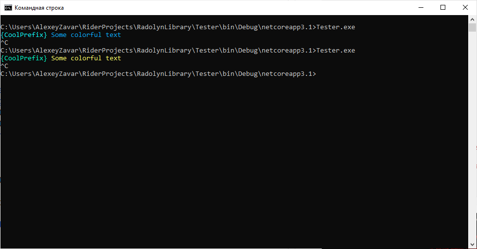
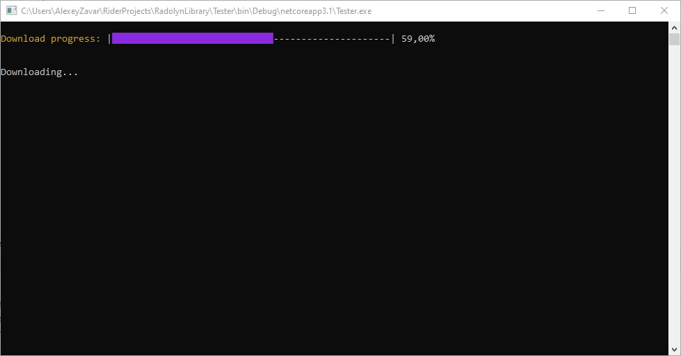
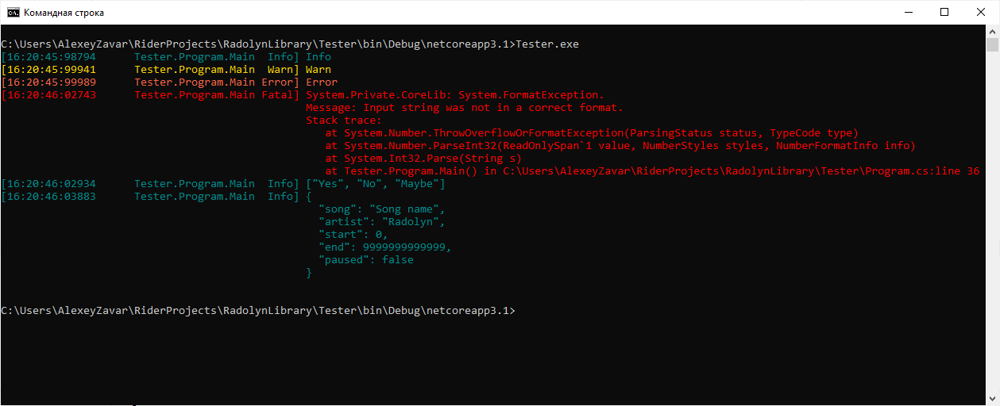
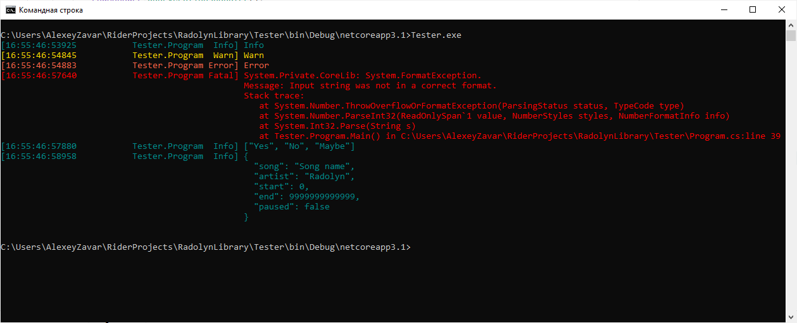

# RadLibrary

[](https://app.codacy.com/gh/Radolyn/RadLibrary/dashboard)
[](https://www.codefactor.io/repository/github/radolyn/radlibrary)
[](https://www.nuget.org/packages/RadLibrary/)

All-In-One library

## Features

- Customizable logger
  - Prints dictionaries and lists like in ```Python```
  - Integrated with ```Configuration Manager```
  - Thread-safe (**almost**)
- Colorful console support
  - Custom colors (**HEX string->Color class convert support** through ```Colorizer```)
  - ESC colors access through ```Font, Background & Foreground``` classes
  - ```Console``` wrapper for ease of use (```ColorfulConsole```)
  - Colorful **input**
  - Colorful **progress bar** with custom animations
- Configuration manager
  - Comments support
  - Scheme support
- Formatters
  - AppConfiguration
  - Any types of Enumerables
  - Exception
  - String
  - __Custom__

## Getting started

Install RadLibrary in your project through [NuGet package](https://www.nuget.org/packages/RadLibrary/) ```RadLibrary```

Initialize library using `Utilities.Initialize()`

## Colorful console

### Write line to the console

```csharp
ColorfulConsole.WriteLine("[#fffff]{CoolPrefix} [aaaff]Some colorful text");

ColorfulConsole.WriteLine("[00ffcc]{CoolPrefix} [#ffff66]Some colorful text");
```



### Progress bar

```csharp
var bar = new ColorfulProgressBar(0, 1, 100);

var wc = new WebClient();
wc.DownloadProgressChanged += (sender, args) =>
{
  bar.Total = args.TotalBytesToReceive;
  bar.Update(args.BytesReceived);
};
wc.DownloadFileCompleted += (sender, args) =>
{
  bar.Finish();
  ColorfulConsole.WriteAt("Done!" + " ".Repeat(Console.WindowWidth), 4);
};

var style = new DefaultStyle(50)
            {Prefix = "Download progress:", FillColor = Color.BlueViolet, PrefixColor = Color.Goldenrod};
bar.Style = style;

// Not required
bar.Update(0);

ColorfulConsole.WriteLine(Environment.NewLine.Repeat(4) + "Downloading...");

wc.DownloadFileAsync(new Uri("https://speed.hetzner.de/1GB.bin"), "test.bin");

Console.ReadLine();
```



## Logging

### Current method logger

```csharp
var logger = LogManager.GetMethodLogger();

logger.Trace("Trace");
logger.Debug("Debug");
logger.Info("Info");
logger.Warn("Warn");
logger.Error("Error");

try
{
  int.Parse("sadasd");
}
catch (Exception e)
{
  logger.Fatal(e);
}

logger.Info(new List<string> { "Yes", "No", "Maybe" });
logger.Info("{\"song\":\"Song name\",\"artist\":\"Radolyn\",\"start\":0,\"end\":9999999999999,\"paused\":false}");

```



### Multilogger sample

```csharp
var consoleLogger = LogManager.GetMethodLogger();
var fileLogger = LogManager.GetMethodLogger<FileLogger>();

var logger = LogManager.GetClassLogger<MultiLogger>(consoleLogger, fileLogger);

logger.Trace("Trace");
logger.Debug("Debug");
logger.Info("Info");
logger.Warn("Warn");
logger.Error("Error");

try
{
  int.Parse("sadasd");
}
catch (Exception e)
{
  logger.Fatal(e);
}

logger.Info(new List<string> { "Yes", "No", "Maybe" });
logger.Info("{\"song\":\"Song name\",\"artist\":\"Radolyn\",\"start\":0,\"end\":9999999999999,\"paused\":false}");

```




## Configuration Manager

### Create configuration using FileManager

```csharp
var logger = LogManager.GetMethodLogger();
var config = new IniManager("test.conf");

config["ip"] = "127.0.0.1";
config["autorun"] = true;
config["key"].SetValue('a');
config["url"] = "https://radolyn.com";

config.Save();

logger.Info(config);
```
